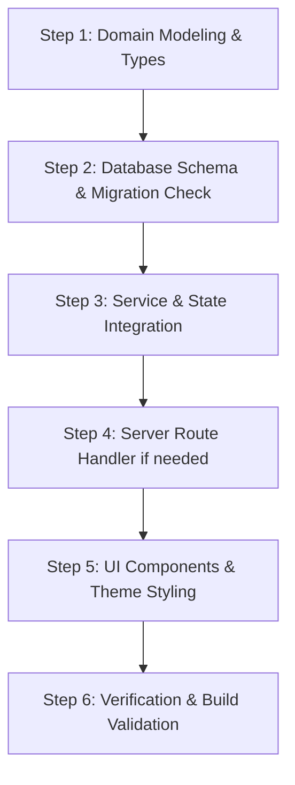

# New Feature Development Playbook — Waynautic Academy

This playbook is the primary operational guide for **any developer or AI agent** implementing a new feature in the Waynautic Academy repository. Follow this document sequentially to ensure full architectural consistency, zero regressions, and immediate production readiness.

---

## 1. System Mental Model & Architecture

Before writing any code, understand how data and components interact in this repository:

```
┌────────────────────────────────────────────────────────────────────────┐
│                          Next.js 15 App Router                         │
│   (App Routes: /curriculum, /dashboard, /profile, /admin, /api/...)   │
└───────────────────▲────────────────────────────────▲───────────────────┘
                    │                                │
     Custom Window Event Bus:                        │ Next.js API Routes:
     'waynautic_storage_change'                      │ /api/ratings
     'waynautic_payments_changed'                    │ /api/curriculum
     'waynautic_curriculum_changed'                  │ /api/curriculum/quiz
                    │                                │
┌───────────────────▼──────────────────────┐         │
│         Client Store (Hybrid)            │         │
│           src/lib/store.ts               │         │
│        src/lib/adminService.ts           │         │
│      src/lib/curriculumService.ts        │         │
├─────────────────────┬────────────────────┤         │
│  Fast Local Layer:  │ Cloud Sync Layer:  │         │
│    Browser Cache    │    Supabase Auth   │         │
│    (localStorage)   │    & PostgreSQL    ├─────────┘
└─────────────────────┴────────────────────┘
```

### The 3 Core Architectural Pillars
1. **Dual-Layer Hybrid Storage**:
   - **Local Cache (`localStorage`)**: Acts as an instant, zero-latency store allowing full offline/demo operation without Supabase gating.
   - **Cloud Layer (`Supabase`)**: When configured and authenticated, syncs bi-directionally on mount, auth change, and user mutations.
2. **Custom Window Event Bus**:
   - React state across components (`useWaynauticStore`, `SkillTree`, `Navbar`, `TopicWorkspaceClient`) updates reactively via window events:
     - `waynautic_storage_change`: Dispatched when user progress, badges, streak, profile, or bookmarks update.
     - `waynautic_payments_changed`: Dispatched when payment status or records update.
     - `waynautic_curriculum_changed`: Dispatched when curriculum topics or quizzes are modified by an admin.
3. **Cross-Member Server Fallback Pattern**:
   - For universal cross-user data (ratings, reviews, curriculum overrides), the portal uses Next.js server route handlers in `src/app/api/` backed by a local JSON store (`src/data/`) and Supabase PostgreSQL. This ensures universal visibility even in local/offline environments.

---

## 2. The 6 "Golden Rules" of the Codebase

Every AI agent and human engineer **must adhere** to these rules:

1. **Rule 1: Never Downgrade Completed Progress**
   - Once a topic is marked `'completed'`, it must **never** be downgraded back to `'in_progress'` by automated triggers (such as video playback, note viewing, or a failed quiz retake).
   - Only allow reversion if the user explicitly clicks the "Mark Complete" toggle with `forceStatus: true`.
2. **Rule 2: Never Wipe Data on Mount**
   - Do **not** call `clearAllUserData()` in component mount effects or when a Supabase session is null/loading. Local guest data must remain intact. Only clear data on explicit `SIGNED_OUT` auth events.
3. **Rule 3: Always Dispatch Domain Events After State Updates**
   - Whenever you write to `localStorage` in a helper or service function, you **must** dispatch the corresponding window event (`waynautic_storage_change`, etc.) so that all listening React components immediately re-render.
4. **Rule 4: Guard for SSR & Hydration Safety**
   - Next.js 15 pre-renders pages on the server. Never access `window`, `localStorage`, or `document` during the initial component render pass. Always use `typeof window !== 'undefined'` guards or wrap browser-dependent logic inside `useEffect`.
5. **Rule 5: Maintain Contrast in Both Dark & Light Modes**
   - Do not hardcode dark text or washed-out backgrounds. Ensure all cards, text headings, code blocks, and diagrams specify both dark and light classes (e.g. `text-slate-900 dark:text-white`, `bg-white dark:bg-[#0D121F]`, `border-slate-200 dark:border-slate-800`).
6. **Rule 6: Validate With `npm run build`**
   - Never consider a feature complete without running `npm run build` to confirm zero TypeScript compilation errors across all 20+ routes.

---

## 3. Step-by-Step Feature Implementation Workflow

When asked to build a new feature, follow this exact 6-step lifecycle:



### Step 1: Domain Modeling & Types
1. Open `src/lib/types.ts` (for student-facing features) or `src/lib/adminTypes.ts` (for admin-facing features).
2. Define clean TypeScript interfaces for the new entity, including optional fields and status enums.
```typescript
// Example: Adding a Flashcard feature
export interface Flashcard {
  id: string;
  topicId: string;
  term: string;
  definition: string;
  isMastered?: boolean;
}
```

### Step 2: Database Schema & Migration Check
1. Open `supabase/schema.sql`.
2. If the feature requires cloud persistence, define the PostgreSQL table with:
   - Primary key (`id uuid default gen_random_uuid()` or `text`).
   - Foreign keys to `auth.users(id)` or `public.topics(id)` with `on delete cascade`.
   - Row Level Security (RLS) policies (`for select`, `for insert`, `for update`).
3. **Check if migration is needed**:
   - If writing SQL that alters live Supabase tables, create a migration file in `supabase/` (e.g., `supabase/add_flashcards_table.sql`) and inform the user if they need to execute it in the Supabase SQL editor.
   - Always implement graceful fallbacks so the app works seamlessly even before the SQL migration is applied.

### Step 3: Service & State Layer Integration
1. Open `src/lib/store.ts` or create a domain-specific service in `src/lib/` (e.g., `src/lib/flashcardService.ts`).
2. Implement:
   - **Local Loader & Saver**: Read/write from `localStorage` using a namespaced key (`waynautic_*`).
   - **Cloud Sync**: Upsert to Supabase if authenticated (`supabase.from('...').upsert(...)`).
   - **Event Trigger**: Fire `window.dispatchEvent(new Event('waynautic_storage_change'))`.
3. Expose the methods via `useWaynauticStore()` in `src/lib/store.ts` if components across multiple pages need direct hook access.

### Step 4: Server Route Handler (If Cross-Member or File-Backed)
1. If the feature requires cross-user universal visibility (like reviews or custom notes), create a Next.js App Router route:
   `src/app/api/[featureName]/route.ts`
2. Implement `GET` and `POST` handlers.
3. Use file-system JSON persistence (`src/data/[featureName].json`) as a reliable fallback alongside Supabase.

### Step 5: UI Components & Theming
1. Place reusable components in `src/components/` (or `src/components/admin/` for admin tools).
2. Use Lucide React icons (`import { ... } from 'lucide-react'`).
3. Follow the established visual design tokens:
   - **Surfaces**: `bg-white dark:bg-[#0D121F]`, `border-2 border-slate-200 dark:border-slate-800`.
   - **Primary CTAs**: `bg-[#58CC02] hover:bg-[#61E002] text-white border-2 border-[#58A700] shadow-[0_2px_0_0_#58A700]`.
   - **Accent Highlights**: Sky/Cyan (`text-sky-600 dark:text-cyan-400`, `bg-sky-50 dark:bg-cyan-950/40`).
   - **Alert / Warning**: Amber (`text-amber-600 dark:text-amber-400`).
   - **Typography**: Inter / Outfit fonts with clear hierarchy (`font-extrabold`, `font-mono text-xs uppercase`).

### Step 6: Verification & Build Validation
1. Test locally by running:
   ```bash
   npm run build
   ```
2. Verify:
   - Zero TypeScript compilation errors.
   - All dynamic routes (`[moduleSlug]`, `[topicSlug]`) build cleanly.
   - No React console hydration warnings (e.g., mismatch between server HTML and client render).

---

## 4. Common Tasks & Where to Implement Them

| Goal | Target Files | Key Implementation Detail |
| :--- | :--- | :--- |
| **Add a new Topic / Curriculum unit** | `src/data/seedTopics.ts`, `src/lib/curriculumService.ts` | Ensure unique `id`, `slug`, `moduleSlug`, estimated minutes, markdown text, and quiz array. |
| **Add a new Quiz or Question** | `src/data/seedModules.ts` or Admin Quiz Editor | Use `QuizQuestion` format with `correctOptionIndex` (0–3) and detailed `explanation`. |
| **Change Payment / Pricing Gateway** | `src/config/payment/upiConfig.ts`, `PaymentBarcodeModal.tsx` | Update UPI ID, payee merchant name, and course fee (`amount: 999.00`). |
| **Modify Admin Verification Logic** | `src/lib/adminService.ts` | Remember to deduplicate verified records by user plan and auto-reconcile redundant requests. |
| **Modify Video Player Behavior** | `src/components/VideoPlayer.tsx` | Supports YouTube (iframe postMessage API) and Bunny.net Stream. Preserve auto-completion at 90% watch milestone. |
| **Modify Topic Lesson Layout** | `src/components/TopicWorkspaceClient.tsx` | Top breadcrumbs, video embed, tab switcher (`watch` / `read` / `quiz`), rating widget, and comments. |
| **Add a Global Badge / Achievement** | `src/lib/store.ts` (`checkAndAwardBadges`) | Add new evaluation criteria to the badge rules array and map a Lucide icon. |

---

## 5. AI Memory Maintenance Protocol

Whenever an AI agent finishes implementing, updating, or debugging a feature in this repository, the agent **MUST** perform the following housekeeping before completing the turn:

1. **Update `ai-memory/CURRENT_STATE.md`**:
   - Move completed items from "IN PROGRESS" or "Backlog" to "What is DONE".
   - Document any new fragile areas, architectural nuances, or bug fixes.
2. **Update `ai-memory/DECISIONS.md`**:
   - If an architectural trade-off or structural choice was made, record a new ADR (`ADR-XXX`).
3. **Log the Working Session in `ai-memory/sessions/YYYY-MM-DD.md`**:
   - Document the objective, files changed, key decisions, and verification steps.
