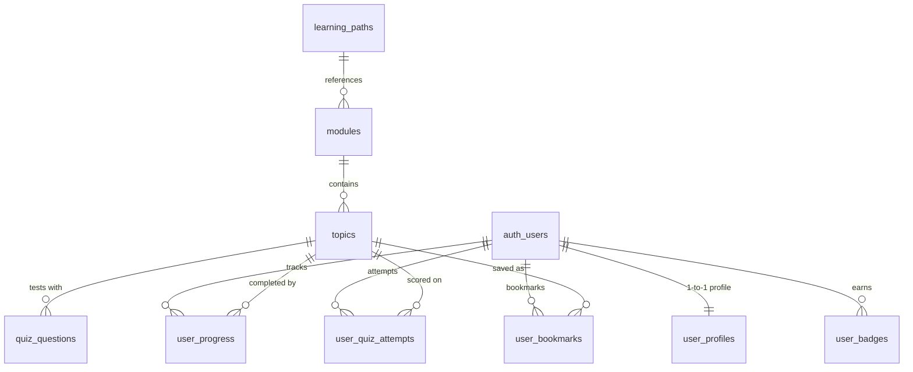

# Schema & APIs — Waynautic Academy

This document outlines the database schema, relational models, Row Level Security (RLS) policies, internal data flows, and external integration points (Supabase & Bunny.net Stream).

---

## 1. Supabase PostgreSQL Schema Overview

The database is defined in [`supabase/schema.sql`](file:///c:/Users/User/OneDrive/Documents/ai%20training/ai%20training%20web%20portal/supabase/schema.sql) and consists of **9 relational tables**:



### Table Definitions & Purposes

| Table Name | Primary Key | Foreign Keys | Purpose |
| :--- | :--- | :--- | :--- |
| `public.modules` | `id (UUID)` | None | Defines the 10 curriculum modules, ordered sequence, slugs, descriptions, difficulty (`Beginner`, `Intermediate`, `Advanced`), and icon identifiers. |
| `public.topics` | `id (UUID)` | `module_id` &rarr; `public.modules(id)` [ON DELETE CASCADE] | Stores individual lesson topics (56 total), video stream URLs, provider type, order index, rich markdown content, and estimated completion minutes. |
| `public.quiz_questions` | `id (UUID)` | `topic_id` &rarr; `public.topics(id)` [ON DELETE CASCADE] | Multi-question quiz banks per topic. Stores question text, `options (JSONB)` string array, `correct_option_index`, and technical explanations. |
| `public.user_profiles` | `id (UUID)` | `id` &rarr; `auth.users(id)` [ON DELETE CASCADE] | User profile metadata (display name, avatar URL, selected learning path `path-a` / `path-b`, timestamps). |
| `public.user_progress` | `id (UUID)` | `user_id` &rarr; `auth.users(id)`, `topic_id` &rarr; `public.topics(id)` | Tracks completion state per user per topic (`not_started`, `in_progress`, `completed`), completion timestamp. Unique on `(user_id, topic_id)`. |
| `public.user_quiz_attempts` | `id (UUID)` | `user_id` &rarr; `auth.users(id)`, `topic_id` &rarr; `public.topics(id)` | Records historical quiz submissions, user score, total questions, and attempt timestamp. |
| `public.user_badges` | `id (UUID)` | `user_id` &rarr; `auth.users(id)` [ON DELETE CASCADE] | Records earned achievements (`first_step`, `quiz_master`, `module_[slug]`). Unique on `(user_id, badge_type)`. |
| `public.learning_paths` | `id (UUID)` | None | Curated learning tracks (`path-a`, `path-b`) with title, description, and an ordered array of module slugs in `module_order (JSONB)`. |
| `public.user_bookmarks` | `id (UUID)` | `user_id` &rarr; `auth.users(id)`, `topic_id` &rarr; `public.topics(id)` | Saved topics for fast learner reference. Unique on `(user_id, topic_id)`. |

---

## 2. Row Level Security (RLS) Policy Matrix

Row Level Security is enabled across all tables to enforce strict data isolation between users and ensure public read access to curriculum materials:

| Table | Operations | Target Role | RLS Policy Condition | Description |
| :--- | :---: | :---: | :--- | :--- |
| `modules` | `SELECT` | Public / Anon | `true` | Public read access for curriculum browsing |
| `topics` | `SELECT` | Public / Anon | `true` | Public read access for lesson reading |
| `quiz_questions` | `SELECT` | Public / Anon | `true` | Public read access for quiz evaluation |
| `learning_paths` | `SELECT` | Public / Anon | `true` | Public read access for learning paths |
| `user_profiles` | `SELECT, INSERT, UPDATE` | Authenticated | `auth.uid() = id` | Users can only view and modify their own profile |
| `user_progress` | `SELECT, INSERT, UPDATE` | Authenticated | `auth.uid() = user_id` | Progress records are strictly private to each user |
| `user_quiz_attempts` | `SELECT, INSERT` | Authenticated | `auth.uid() = user_id` | Quiz attempts are private to the user |
| `user_badges` | `SELECT, INSERT` | Authenticated | `auth.uid() = user_id` | Badges can only be viewed and inserted by the recipient |
| `user_bookmarks` | `SELECT, INSERT, DELETE` | Authenticated | `auth.uid() = user_id` | Bookmarks are private and user-managed |

### Automated Profile Creation Trigger
When a new user registers via Supabase Auth (`auth.users`), a PostgreSQL security definer trigger automatically creates their corresponding `public.user_profiles` row:

```sql
create or replace function public.handle_new_user()
returns trigger as $$
begin
  insert into public.user_profiles (id, display_name, avatar_url)
  values (
    new.id, 
    coalesce(new.raw_user_meta_data->>'full_name', new.raw_user_meta_data->>'name', split_part(new.email, '@', 1)), 
    new.raw_user_meta_data->>'avatar_url'
  );
  return new;
end;
$$ language plpgsql security definer;

create or replace trigger on_auth_user_created
  after insert on auth.users
  for each row execute procedure public.handle_new_user();
```

---

## 3. Internal API Routes & Client Data Layer

### Current Implementation (Direct Client Store)
Currently, Waynautic Academy uses direct client-side querying via `@supabase/supabase-js` and the in-memory/LocalStorage store (`src/lib/store.ts`):
- **Curriculum & Topics Data**: Read instantly from typed seed constants (`seedModules.ts` and `seedTopics.ts`).
- **User Progress & State**: Read and written via `useWaynauticStore` functions (`saveProgress`, `saveProfile`, `toggleBookmark`, `checkAndAwardBadges`).
- **Supabase Authentication**: Handled directly via `supabase.auth.signInWithPassword`, `supabase.auth.signUp`, and `supabase.auth.signInWithOAuth` in [`src/app/login/page.tsx`](file:///c:/Users/User/OneDrive/Documents/ai%20training/ai%20training%20web%20portal/src/app/login/page.tsx) and [`src/app/signup/page.tsx`](file:///c:/Users/User/OneDrive/Documents/ai%20training/ai%20training%20web%20portal/src/app/signup/page.tsx).

### Planned Serverless API Routes (Backlog)
- `POST /api/video/watch-progress`: Secure endpoint to record video watch beacons and verify 90% view-time.
- `POST /api/certificates/verify`: Endpoint for public verification of certificate IDs (`WAC-XXXXXX`).

---

## 4. Bunny.net Stream Integration Points

### Current Playback Integration
In [`src/components/VideoPlayer.tsx`](file:///c:/Users/User/OneDrive/Documents/ai%20training/ai%20training%20web%20portal/src/components/VideoPlayer.tsx), the video component inspects the `videoUrl` property from the topic schema:
1. **YouTube Detection**: If `videoUrl` contains `youtube.com` or `youtu.be`, it dynamically reformats the URL to `https://www.youtube.com/embed/{videoId}?autoplay=1&rel=0`.
2. **Bunny.net Stream Detection**: For URLs pointing to Bunny.net Stream (e.g. `https://iframe.mediadelivery.net/embed/{libraryId}/{videoId}` or Direct HLS), it embeds the Bunny Stream responsive iframe player.
3. **90% Completion Hook**: `VideoPlayer` triggers an `onProgress90` callback after video initiation, automatically unlocking completion credit for the lesson.

### Target Bunny Stream Tokenized Architecture
*(TBD — details to finalize with Pramod)*:
- **Video ID Mapping**: Store Bunny `video_guid` and `library_id` in `public.topics.video_url`.
- **Token Security**: Generate short-lived SHA-256 tokenized embed URLs on request to prevent unauthorized video hotlinking.
- **Bunny Player JS SDK**: Embed `https://player.bunny.net/script.js` to capture exact `player.on('ended')` and `player.on('timeupdate')` events.
